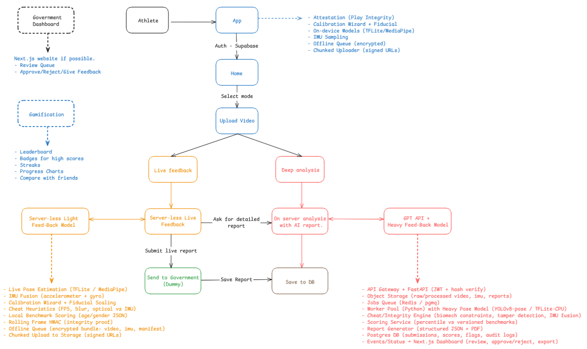

# Sports Talent Assessment Platform

This is a hackathon project that tries to make sports talent assessment more accessible in India. The idea is simple: athletes can record short videos of standard fitness tests like pushups or jumps on their phone, and the system will analyze the performance using computer vision. Results are stored and verified so officials can track progress and spot potential talent.

## What it does

- Mobile app to record and upload performance videos  
- On-device light analysis for quick rep counts and feedback  
- Backend API with FastAPI and Supabase for authentication and data storage  
- Deep analysis worker that uses pose estimation to check form, count reps, and generate scores  
- Dashboard to view results and athlete data  

## Why we built it

Identifying athletes in a country as big as India is tough, especially in rural areas. Standardized tests exist but are not easy to deploy everywhere. This project is an attempt to democratize the process so anyone with a smartphone can participate and get feedback.

  

## Tech stack

- **Frontend**: React Native (Expo), Tailwind for styling  
- **Backend**: FastAPI with Supabase for auth and database  
- **Storage**: Cloudflare R2 for videos and results  
- **ML**: YOLOv8 pose estimation for pushup analysis  
- **Infra**: Uvicorn for serving, Upstash Redis for job queue, Supabase for database and auth
